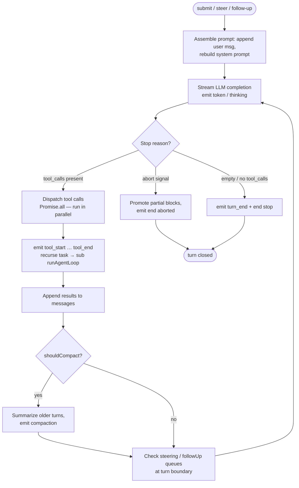
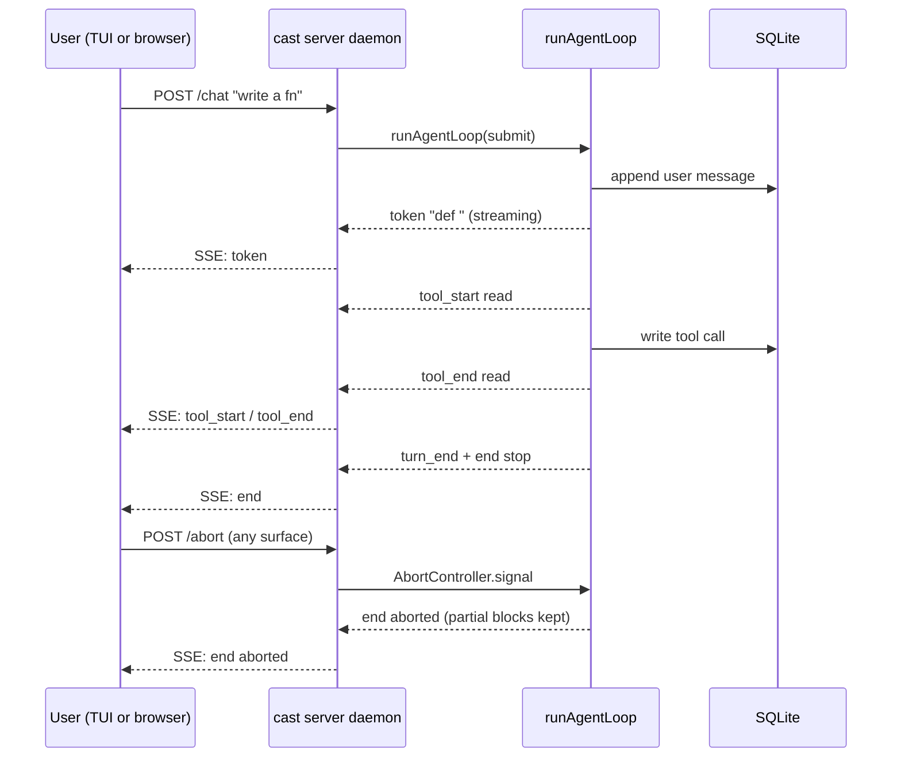

# Architecture

An overview of cast's source layout and key design decisions. For contributors and the curious.

## Source Layout

```
src/
  core/               Agent logic (no UI dependency)
    loop.ts           Agent loop — streaming, tool dispatch, compaction
    tools.ts          Built-in tool definitions + executors
    tools/
      bash.ts         Shell execution
      files.ts        Read/write/edit
      search.ts       Find/grep/ls
      web.ts          web_search (DuckDuckGo), web_fetch (Jina Reader)
      task.ts         Sub-agent delegation
      shared.ts       Shared types (ToolResult, ConfirmBash)
    llm.ts            LLM interaction, streaming, retry, prompt caching
    session.ts        Session persistence, token estimation, compaction
    mcp.ts            MCP server connection (stdio + Streamable HTTP, legacy HTTP+SSE fallback)
    personas.ts       Persona loading (project > global > builtin)
    rules.ts          Cursor-compatible rule system (always/auto/lazy/manual)
    skills.ts         Agent Skills spec implementation
    plugins.ts        Marketplace catalogs + plugin install (skills and hooks)
    config.ts         AppConfig, model validation, onboarding
    context-files.ts  AGENTS.md / CLAUDE.md discovery
    project.ts        System prompt assembly, trust gating
    startup.ts        Unified startup orchestration
    runner.ts         Queue management (steering, follow-ups)
    run.ts            Non-interactive runner (cast run)
    vendors.ts        Reasoning provider dialects, metadata, and think-block parsing
    upgrade.ts        Self-update via GitHub releases
    permissions.ts    Dangerous bash command detection
    plan.ts           Plan mode state, file I/O, read-only bash gate
    frontmatter.ts    Minimal YAML frontmatter parser
    prompts.ts        Prompt file loading
    readline.ts       Readline utilities, models cache
    settings.ts       User settings persistence
    stdin-manager.ts  Stdin ownership between Ink and child processes
    subagents.ts      Sub-agent prompt loading
    help.ts           Banner, help text, changelog
    ...
  ui/                 Ink TUI components
    App.tsx           Top-level layout
    Composer.tsx      Input with autocomplete, image paste
    ChatLog.tsx       Message rendering
    commands.ts       Slash command handlers
    themes/           Color theme registry and definitions
    input/            Keybindings, input handling
    ...
  pickers/            Onboarding pickers (model, persona, reasoning)
  server/             HTTP server, REST/SSE bridge, browser client
  index.ts            CLI entry point
```

## Key Design Decisions

### Single OpenAI-Compatible Provider

cast speaks the OpenAI chat completions format. Supported providers include OpenRouter, OpenAI, Ollama, vLLM, LiteLLM, and Azure OpenAI. A small provider-dialect layer normalizes reasoning controls and native reasoning streams without forking the agent loop.

### Parallel Tool Execution

Tool calls within one assistant message run concurrently via `Promise.all`. If the model requests `bash`, `read`, and `grep` in a single response, all three execute simultaneously.

### Hashline LRU Cache

`read`, `edit`, and `grep` share a process-local LRU (20 entries, ~4 MB worst case) keyed by absolute path. On hit, mtime validation occurs; on miss, the file is read once and per-line sha1 hashes are computed in a single pass. `write` and `edit` invalidate the entry on success so follow-up reads skip redundant file I/O and line hashing.

### Context Compaction

When conversation history exceeds ~75% of the context window, older messages are summarized by the LLM. The split snaps to turn boundaries so tool calls and results stay paired. File paths are extracted deterministically from tool calls and appended to the summary.

### MCP Integration

MCP tools are namespaced as `mcp_<server>_<tool>` and converted to built-in `Tool`/`ToolResult` shapes.

### The Agent Loop (`runAgentLoop`)

`src/core/loop.ts` is the single engine both surfaces drive. One invocation is one **turn**; a session is a sequence of turns. The loop is streaming-by-construction: it never waits to collect a full response before emitting.



A turn runs as a bounded outer iteration:

1. **Prompt assembly.** The user message (or a steered/follow-up message injected mid-turn) is appended to `session.messages`. The system prompt is rebuilt per turn via `rebuildSystemPrompt` (sticky rules + `@`-mention context files).
2. **LLM streaming.** The provider is called in streaming mode. Deltas arrive as `token` (content) and `thinking` (reasoning) events and are folded into the live transcript as they land.
3. **Tool dispatch.** When the model returns `tool_calls`, each call is dispatched. **Tool calls within one assistant message run concurrently** via `Promise.all` — `bash`, `read`, and `grep` requested together execute simultaneously, not in sequence. Each tool emits `tool_start` / `tool_end`; sub-agents (`task` tool) recurse into their own `runAgentLoop` invocation.
4. **Tool results → next iteration.** Results are appended and the loop streams another model call. The iteration continues until the model returns no tool calls (a final answer), hits a stop reason, or is aborted.
5. **Turn close.** `turn_end` promotes the live streaming blocks into permanent history; `end` carries the stop reason (`stop` / `aborted` / `error` / `disconnected`). The session is persisted to SQLite incrementally as messages and tool results accumulate — not just at turn end.

**Queues.** While a turn runs, a `steeringQueue` (injected mid-turn, before the next model call) and a `followUpQueue` (appended after the turn ends) let the user influence or extend the run without starting a parallel writer. The loop checks these at turn boundaries, so a steer typed during a long tool phase lands at the next model call rather than spawning a competing turn.

**Events.** Every state change is emitted as an `AgentEvent` (`token`, `thinking`, `tool_start`, `tool_end`, `usage`, `turn_end`, `end`, `error`, `compaction`, …). The server daemon maps these to `WebEvent` and broadcasts them over SSE. TUI, Web UI, `cast run`, and `cast run --interactive` consume that stream; surfaces never re-derive loop state.



**Abort.** An `AbortController` signal threads through the active LLM stream and tool calls; `abort` (from either surface) flips it, the in-flight stream is cancelled, and the turn closes with `end { reason: "aborted" }`. No partial turn is silently dropped — the already-streamed blocks are promoted to history before close.

**Compaction.** When history exceeds ~75% of the context window, older messages are summarized by the LLM (see Context Compaction below). The split snaps to turn boundaries so tool calls and results stay paired.

For how the TUI, web UI, and the `cast server` daemon are wired around this loop — processes, lifecycles, auth, and the TUI-only `CAST_NO_DAEMON=1` fallback — see [Infrastructure](infrastructure.md).

### Trust Gating

A single trust decision per project gates local skills, MCP, context files, personas, rules, hooks, and SSH configuration. Global resources in `~/.cast/` load automatically.

### Plan Mode

Plan mode is a restricted agent state: read-only bash (a curated allowlist of inspection binaries), unrestricted read, and `write`/`edit` narrowed to the session plans directory. Plan files persist as markdown with checkbox tracking.

### System Reminders & Open Work Gate

To prevent models from losing context during long turns or date rollovers, cast injects system reminders into the context:
- **Date Rollover**: Injects an updated system date reminder when a session crosses a calendar boundary.
- **Compaction Reminder**: Refreshes context guidance after recent compactions.
- **Open Work Gate**: In Build mode, `open-work-gate.ts` monitors active `todo_write` items. If open work remains (`in_progress` or `pending`), the harness prevents the turn from finishing without updating task statuses.

### Session-Scoped Git Worktrees

The worktree module (`worktree.ts`) isolates session execution in `.cast/worktrees/<slug>` on a dedicated `cast-<slug>` branch. `session.cwd` points directly to the worktree root, isolating file tools and bash commands from the user's main checkout while sharing the git object DB. Worktree paths persist in SQLite session state (`SessionState.cwd`), ensuring resumes automatically stay in the worktree.

## Development

```bash
npm install --ignore-scripts
npm start               # Run from source (tsx)
npm run check           # Type check + lint (tsc + biome)
npm test                # Unit tests (vitest)
npm run build           # Bundle into dist/index.js (esbuild)
npm run format          # Auto-format (biome)
```

### Testing

- Framework: vitest
- One `test/<module>.test.ts` per `src/<module>.ts`
- Mock configs with fake `baseURL`/`apiKey` (no real LLM API calls)
- MCP tests spawn a local test-fixture server
- Tool tests use temporary directories in `test/__test_tmp__/`

### Build

The bundle step (esbuild) produces a single self-contained `dist/index.js` file requiring no runtime `node_modules`.
