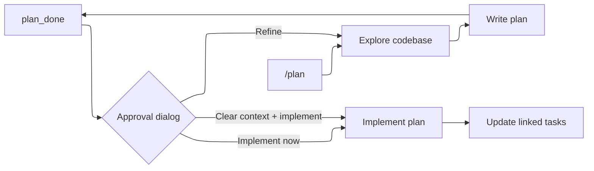

# Plan Mode

Plan mode restricts the agent to exploration and planning. It reads files and produces a structured plan without executing code, modifying project files, or running arbitrary shell commands. The plan file itself is the sole exception: `write` and `edit` remain active when scoped to a `.md` file inside the session plans directory.

## Workflow



1. **Enter plan mode**: Type `/plan`
2. **Explore**: The agent reads files, executes read-only shell commands, and analyzes the codebase
3. **Write plan**: The agent produces a structured markdown plan with a checklist
4. **Review**: The agent signals completion with `plan_done`, displaying the full plan file path
5. **Approve**: An approval dialog opens at the end of the turn with options: refine (returns to composer where your next message becomes planning feedback), implement now, or implement in a clean context. `/build` exits plan mode manually.
6. **Implement**: The agent executes the plan and updates its linked task list after each verified step

## What's Allowed in Plan Mode

### Read-Only Bash

Only inspection commands are allowed. The allowlist includes:

`ls`, `cat`, `head`, `tail`, `wc`, `grep`, `rg`, `fd`, `find`, `file`, `stat`, `du`, `df`, `tree`, `diff`, `sort`, `uniq`, `cut`, `nl`, `realpath`, `dirname`, `basename`, `which`, `pwd`, `echo`, `printf`, `date`, `column`, `strings`, `jq`, `yq`

Git read-only subcommands: `log`, `show`, `diff`, `status`, `blame`, `rev-parse`, `ls-files`, `ls-tree`, `ls-remote`, `shortlog`, `describe`, `grep`, `reflog`, `cat-file`, `count-objects`

### Blocked

- Output redirection (`>`)
- Command and process substitution (`$()`, backticks, `<()`)
- Binaries outside the allowlist (`env`, test runners, and package managers)
- Argument-level writers on allowlisted binaries: `find -delete`/`-exec`, `fd -x`, `sort -o`, `tree -o`, `--output`, `uniq in out`
- `write` and `edit` outside the plan directory

`web_search` and `web_fetch` follow the `/web` toggle in both modes.

### MCP Tools

MCP tools remain enabled in plan mode because many servers provide read-only research capabilities (documentation lookup, code search). Because cast cannot automatically infer whether a server tool mutates state, the system prompt instructs the model to perform inspection only. Users receive a warning on plan mode entry when active MCP servers are connected.

## Plan Tools

The plan file is authored and read using standard `write`, `edit`, and `read` tools. `write` and `edit` are restricted to a `.md` file inside the session plans directory during plan mode.
active; reading that same file makes it the active plan (no `name` argument
needed). Other plans in the session are discoverable with `ls`/`glob` on the
plans directory. There is no separate plan-write/plan-edit/plan-read tool: no dedicated
authoring or reading tool, just a permission-level path exception for the
plan file.

| Tool | Mode | Description |
|------|------|-------------|
| `plan_done` | Plan | Signal plan is ready for review |

## Plan Files

Plans are stored as markdown files:

```
<project>/.cast/plans/<session-id>/
  auth-refactor.md
  database-migration.md
```

One directory per session. Multiple named plans can exist in a session.

### Plan Format

Plans use markdown with sections. The recommended structure:

```markdown
## Context

Why this work is needed.

## Steps

- [ ] Step 1: Do the first thing
- [ ] Step 2: Do the second thing
- [ ] Step 3: Verify

## Verification

How to confirm the changes work.

## Assumptions

Any assumptions made during planning.
```

The checklist (`- [ ]`) format identifies the steps projected into the build-mode task list. The plan stays unchanged after approval; task status tracks execution.

## Commands

| Command | Description |
|---------|-------------|
| `/plan` | Enter plan mode |
| `/build` | Exit plan mode, restore full toolset |
| `/plan-model [name\|off]` | Model used while plan mode is active |

Mode switching is rejected while a run is active — modes flip only between runs.

`/build` with an existing plan is the approval gesture — the plan is injected into the build-mode system prompt so the agent's next message starts implementation guided by it.

## What the Model Sees

### Plan Mode

When plan mode is active, a restriction block is prepended to the system prompt:

```
══════════════════════════════════════════════
PLAN MODE ACTIVE — no changes allowed
══════════════════════════════════════════════
You are in plan mode: read, search, and think — change nothing.

Restrictions:
- write and edit only reach the plan file itself — any .md file directly
  inside <plans directory> (no subdirectories). Anything else is refused
- bash is INSPECTION-ONLY (allowlisted read-only binaries)
- You cannot switch modes yourself
```

The block names the session's actual plans directory (a `{{PLANS_DIR}}` template filled in per-session), so the model knows exactly where it may write. It is instructed to: understand the task → explore the codebase → write a plan with `write`/`edit` → call `plan_done`.

### Build Mode

When you type `/build` with an approved plan, the plan is injected into the system prompt:

```
An approved plan exists for this task. It was written in plan mode and reviewed by the user:

<plan>
[plan content]
</plan>

Follow the plan step by step. Its steps are projected into the task list; update the matching task after completing and verifying each step.
```

The plan stays in the system prompt across turns and survives compaction — it's re-read from disk on each run.

### Plan Fully Executed

Once every linked task is complete, the plan is replaced with a brief reference:

```
The approved plan "name" for this task has been fully executed — every linked
task is complete. It no longer steers the work; treat new requests on their own terms.
```

## Per-Phase Model

`/plan-model` sets a model used only while plan mode is active (stored as `planModel` in settings, like `subagentModel`). The typical split: an expensive high-quality model for planning, a cheap one for building, a fast one for sub-agents. The status bar, the system prompt `Model:` line, and the actual requests all report the model in use; `/plan-model off` returns plan mode to the main model.

## Plan Mode Persistence

The plan mode state is per-session. If you quit mid-planning and resume the session, the mode is restored. A fresh session always starts in build mode.
